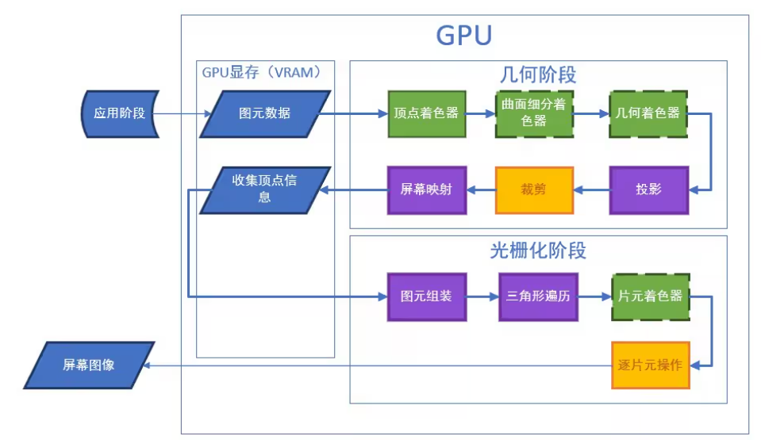

### 一、 核心阶段详解
1. 应用阶段 (Application Stage) —— CPU 的舞台
这是渲染的起点，主要在 CPU 中运行。
- 主要任务：准备场景数据（模型、贴图、光源）、进行视锥体剔除（不在镜头内的物体不提交给 GPU）、计算动画等。
- Draw Call 的发生地：当 CPU 准备好数据后，会发送一条指令给 GPU：“嘿，用这组数据和这个材质画出这个物体！”这个指令就是 Draw Call。

>>> 
2. GPU 显存 (VRAM) —— 数据的仓库
在正式渲染前，数据必须从内存（RAM）拷贝到显存（VRAM）中，因为 GPU 访问显存的速度极快。
- 图元数据：存储顶点的坐标、法线、颜色、纹理坐标（UV）等。
- 收集顶点信息：GPU 从显存中读取这些原始数据，准备进入几何阶段。

3. 几何阶段 (Geometry Stage) —— 处理“形”
这个阶段决定了物体在 3D 空间中长什么样，以及在屏幕的什么位置。
- 顶点着色器 (Vertex Shader)：必选。将每个顶点从模型空间转到世界空间，再转到裁剪空间。
- 曲面细分/几何着色器：可选。用于动态增加模型精细度（比如让平整的地面生出凹凸的岩石）。
- 投影 (Projection)：处理透视关系（近大远小）。
- 裁剪 (Clipping)：把屏幕外看不见的部分裁掉。
- 屏幕映射 (Screen Mapping)：把 3D 坐标转换成 2D 屏幕坐标（比如 1920x1080 的像素坐标）。

4. 光栅化阶段 (Rasterization Stage) —— 处理“色”
将几何阶段生成的矢量三角形转换成屏幕上的像素点（片元）。
- 图元组装 & 三角形遍历：确定哪些像素被三角形覆盖了。
- 片元着色器 (Fragment Shader)：最耗性能的一步。计算每个像素的最终颜色（采样贴图、计算光照、阴影）。
- 逐片元操作 (Per-Sample Procs)：
- 深度测试 (Z-Test)：比较像素的深度，决定谁挡住了谁。
- 模板测试/混合 (Blending)：处理透明物体的颜色叠加。

### 二、 深度解析：Draw Call 到底是什么？
Draw Call 是 CPU 对图形 API（如 OpenGL/DirectX）的一次调用，通知 GPU 进行渲染。
- Draw Call 太多如何优化？
批处理 (Batching)：把使用相同材质的模型合并成一个大的 Draw Call 提交。
实例化渲染 (Instancing)：画一千棵相同的树，只用一个 Draw Call。


### 三、顶点着色器和片元着色器的作用
- **顶点着色器**: 处理每个顶点，进行坐标变换
- **片元着色器**: 处理每个像素，计算最终颜色

实例代码：

## 1. BasicVertexFragment.shader
```hlsl
Shader "Custom/BasicVertexFragment"
{
    Properties
    {
        _Color ("Color", Color) = (1,1,1,1)
    }
    
    SubShader
    {
        Tags { "RenderType"="Opaque" }
        
        Pass
        {
            CGPROGRAM
            #pragma vertex vert
            #pragma fragment frag
            
            #include "UnityCG.cginc"
            
            struct appdata
            {
                float4 vertex : POSITION;
            };
            
            struct v2f
            {
                float4 vertex : SV_POSITION;
            };
            
            float4 _Color;
            
            v2f vert (appdata v)
            {
                v2f o;
                o.vertex = UnityObjectToClipPos(v.vertex);
                return o;
            }
            
            fixed4 frag (v2f i) : SV_Target
            {
                return _Color;
            }
            ENDCG
        }
    }
}
```

## 2. TextureShader.shader
```hlsl
Shader "Custom/TextureShader"
{
    Properties
    {
        _MainTex ("Texture", 2D) = "white" {}
        _Color ("Tint Color", Color) = (1,1,1,1)
    }
    
    SubShader
    {
        Tags { "RenderType"="Opaque" }
        
        Pass
        {
            CGPROGRAM
            #pragma vertex vert
            #pragma fragment frag
            
            #include "UnityCG.cginc"
            
            struct appdata
            {
                float4 vertex : POSITION;
                float2 uv : TEXCOORD0;
            };
            
            struct v2f
            {
                float2 uv : TEXCOORD0;
                float4 vertex : SV_POSITION;
            };
            
            sampler2D _MainTex;
            float4 _MainTex_ST;
            float4 _Color;
            
            v2f vert (appdata v)
            {
                v2f o;
                o.vertex = UnityObjectToClipPos(v.vertex);
                o.uv = TRANSFORM_TEX(v.uv, _MainTex);
                return o;
            }
            
            fixed4 frag (v2f i) : SV_Target
            {
                fixed4 texColor = tex2D(_MainTex, i.uv);
                return texColor * _Color;
            }
            ENDCG
        }
    }
}
```

## 3. LambertLighting.shader
```hlsl
Shader "Custom/LambertLighting"
{
    Properties
    {
        _MainTex ("Texture", 2D) = "white" {}
        _Color ("Color", Color) = (1,1,1,1)
        _Glossiness ("Smoothness", Range(0,1)) = 0.5
        _Metallic ("Metallic", Range(0,1)) = 0.0
    }
    
    SubShader
    {
        Tags { "RenderType"="Opaque" }
        
        Pass
        {
            Tags { "LightMode" = "ForwardBase" }
            
            CGPROGRAM
            #pragma vertex vert
            #pragma fragment frag
            #pragma multi_compile_fwdbase
            
            #include "UnityCG.cginc"
            #include "Lighting.cginc"
            
            struct appdata
            {
                float4 vertex : POSITION;
                float3 normal : NORMAL;
                float2 uv : TEXCOORD0;
            };
            
            struct v2f
            {
                float2 uv : TEXCOORD0;
                float4 vertex : SV_POSITION;
                float3 worldNormal : TEXCOORD1;
                float3 worldPos : TEXCOORD2;
            };
            
            sampler2D _MainTex;
            float4 _MainTex_ST;
            float4 _Color;
            float _Glossiness;
            float _Metallic;
            
            v2f vert (appdata v)
            {
                v2f o;
                o.vertex = UnityObjectToClipPos(v.vertex);
                o.uv = TRANSFORM_TEX(v.uv, _MainTex);
                o.worldNormal = UnityObjectToWorldNormal(v.normal);
                o.worldPos = mul(unity_ObjectToWorld, v.vertex).xyz;
                return o;
            }
            
            fixed4 frag (v2f i) : SV_Target
            {
                // 纹理采样
                fixed4 texColor = tex2D(_MainTex, i.uv);
                
                // Lambert光照计算
                float3 lightDir = normalize(_WorldSpaceLightPos0.xyz);
                float diff = max(0, dot(i.worldNormal, lightDir));
                
                // 环境光
                float3 ambient = UNITY_LIGHTMODEL_AMBIENT.rgb;
                
                // 最终颜色
                fixed4 finalColor = texColor * _Color;
                finalColor.rgb = finalColor.rgb * (diff + ambient);
                
                return finalColor;
            }
            ENDCG
        }
    }
}
```

## 4. PhongLighting.shader
```hlsl
Shader "Custom/PhongLighting"
{
    Properties
    {
        _MainTex ("Texture", 2D) = "white" {}
        _Color ("Color", Color) = (1,1,1,1)
        _SpecularColor ("Specular Color", Color) = (1,1,1,1)
        _Shininess ("Shininess", Range(1, 256)) = 32
    }
    
    SubShader
    {
        Tags { "RenderType"="Opaque" }
        
        Pass
        {
            Tags { "LightMode" = "ForwardBase" }
            
            CGPROGRAM
            #pragma vertex vert
            #pragma fragment frag
            #pragma multi_compile_fwdbase
            
            #include "UnityCG.cginc"
            #include "Lighting.cginc"
            
            struct appdata
            {
                float4 vertex : POSITION;
                float3 normal : NORMAL;
                float2 uv : TEXCOORD0;
            };
            
            struct v2f
            {
                float2 uv : TEXCOORD0;
                float4 vertex : SV_POSITION;
                float3 worldNormal : TEXCOORD1;
                float3 worldPos : TEXCOORD2;
            };
            
            sampler2D _MainTex;
            float4 _MainTex_ST;
            float4 _Color;
            float4 _SpecularColor;
            float _Shininess;
            
            v2f vert (appdata v)
            {
                v2f o;
                o.vertex = UnityObjectToClipPos(v.vertex);
                o.uv = TRANSFORM_TEX(v.uv, _MainTex);
                o.worldNormal = UnityObjectToWorldNormal(v.normal);
                o.worldPos = mul(unity_ObjectToWorld, v.vertex).xyz;
                return o;
            }
            
            fixed4 frag (v2f i) : SV_Target
            {
                // 纹理采样
                fixed4 texColor = tex2D(_MainTex, i.uv);
                
                // 光照方向
                float3 lightDir = normalize(_WorldSpaceLightPos0.xyz);
                float3 viewDir = normalize(_WorldSpaceCameraPos.xyz - i.worldPos);
                float3 reflectDir = reflect(-lightDir, i.worldNormal);
                
                // Lambert漫反射
                float diff = max(0, dot(i.worldNormal, lightDir));
                
                // Phong镜面反射
                float spec = pow(max(0, dot(viewDir, reflectDir)), _Shininess);
                
                // 环境光
                float3 ambient = UNITY_LIGHTMODEL_AMBIENT.rgb;
                
                // 最终颜色计算
                float3 diffuse = texColor.rgb * _Color.rgb * diff * _LightColor0.rgb;
                float3 specular = _SpecularColor.rgb * spec * _LightColor0.rgb;
                float3 ambientColor = texColor.rgb * _Color.rgb * ambient;
                
                fixed4 finalColor = fixed4(diffuse + specular + ambientColor, 1.0);
                return finalColor;
            }
            ENDCG
        }
    }
}
```

## 5. NormalMapShader.shader
```hlsl
Shader "Custom/NormalMapShader"
{
    Properties
    {
        _MainTex ("Albedo (RGB)", 2D) = "white" {}
        _NormalMap ("Normal Map", 2D) = "bump" {}
        _Color ("Color", Color) = (1,1,1,1)
        _BumpScale ("Bump Scale", Range(0,2)) = 1.0
    }
    
    SubShader
    {
        Tags { "RenderType"="Opaque" }
        
        Pass
        {
            Tags { "LightMode" = "ForwardBase" }
            
            CGPROGRAM
            #pragma vertex vert
            #pragma fragment frag
            #pragma multi_compile_fwdbase
            
            #include "UnityCG.cginc"
            #include "Lighting.cginc"
            #include "UnityStandardUtils.cginc"
            
            struct appdata
            {
                float4 vertex : POSITION;
                float3 normal : NORMAL;
                float4 tangent : TANGENT;
                float2 uv : TEXCOORD0;
            };
            
            struct v2f
            {
                float2 uv : TEXCOORD0;
                float4 vertex : SV_POSITION;
                float3 worldPos : TEXCOORD1;
                float3 tspace0 : TEXCOORD2; // tangent.x, bitangent.x, normal.x
                float3 tspace1 : TEXCOORD3; // tangent.y, bitangent.y, normal.y
                float3 tspace2 : TEXCOORD4; // tangent.z, bitangent.z, normal.z
            };
            
            sampler2D _MainTex;
            sampler2D _NormalMap;
            float4 _MainTex_ST;
            float4 _Color;
            float _BumpScale;
            
            v2f vert (appdata v)
            {
                v2f o;
                o.vertex = UnityObjectToClipPos(v.vertex);
                o.uv = TRANSFORM_TEX(v.uv, _MainTex);
                o.worldPos = mul(unity_ObjectToWorld, v.vertex).xyz;
                
                // 计算切线空间矩阵
                float3 worldNormal = UnityObjectToWorldNormal(v.normal);
                float3 worldTangent = UnityObjectToWorldDir(v.tangent.xyz);
                float3 worldBitangent = cross(worldNormal, worldTangent) * v.tangent.w;
                
                o.tspace0 = float3(worldTangent.x, worldBitangent.x, worldNormal.x);
                o.tspace1 = float3(worldTangent.y, worldBitangent.y, worldNormal.y);
                o.tspace2 = float3(worldTangent.z, worldBitangent.z, worldNormal.z);
                
                return o;
            }
            
            fixed4 frag (v2f i) : SV_Target
            {
                // 采样法线贴图
                float3 normalMap = UnpackNormal(tex2D(_NormalMap, i.uv));
                normalMap.xy *= _BumpScale;
                normalMap.z = sqrt(1.0 - saturate(dot(normalMap.xy, normalMap.xy)));
                
                // 转换到世界空间
                float3 worldNormal;
                worldNormal.x = dot(i.tspace0, normalMap);
                worldNormal.y = dot(i.tspace1, normalMap);
                worldNormal.z = dot(i.tspace2, normalMap);
                worldNormal = normalize(worldNormal);
                
                // 纹理采样
                fixed4 texColor = tex2D(_MainTex, i.uv);
                
                // Lambert光照计算
                float3 lightDir = normalize(_WorldSpaceLightPos0.xyz);
                float diff = max(0, dot(worldNormal, lightDir));
                
                // 环境光
                float3 ambient = UNITY_LIGHTMODEL_AMBIENT.rgb;
                
                // 最终颜色
                fixed4 finalColor = texColor * _Color;
                finalColor.rgb = finalColor.rgb * (diff + ambient);
                
                return finalColor;
            }
            ENDCG
        }
    }
}
```